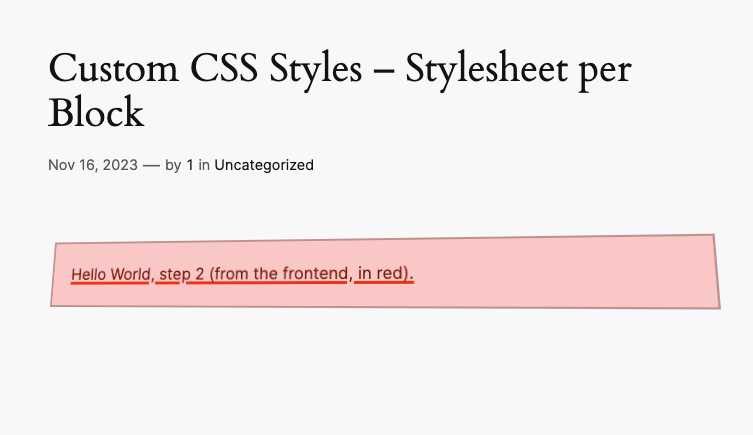

### Block Development Examples - Stylesheets 79a4c3

This example shows how to apply styles to blocks using different sources:
- inline styles (through `useBlockProps`)
- default classes (`wp-block-block-development-examples-stylesheets-79a4c3`)
- custom classes (`hasPerspective` through `useBlockProps`)
- styles only for the editor (`editor.scss`)
- styles shared by the editor and the frontend (`style.scss`)

<!-- Please, do not remove these @TABLE EXAMPLES BEGIN and @TABLE EXAMPLES END comments or modify the table inside. This table is automatically generated from the data at _data/examples.json and _data/tags.json -->
<!-- @TABLE EXAMPLES BEGIN -->
| Folder                                                                                              | Short description | Tags                                                                                                                         | ID ([❓](https://github.com/WordPress/block-development-examples/wiki/04-Why-an-ID-for-every-example%3F "Why an ID for every example?")) | Download .zip                                                                                                                                                                                                                                                  | Live Demo                                                                                                                                                                                                                                                                                                                                                                          |
| --------------------------------------------------------------------------------------------------- | ------------------------------------------------------------------------- | ---------------------------------------------------------------------------------------------------------------------------- | --------------------------------------------------------------------------------------------------------------------------------------- | -------------------------------------------------------------------------------------------------------------------------------------------------------------------------------------------------------------------------------------------------------------- | ---------------------------------------------------------------------------------------------------------------------------------------------------------------------------------------------------------------------------------------------------------------------------------------------------------------------------------------------------------------------------------- |
| [📁](https://github.com/WordPress/block-development-examples/tree/trunk/plugins/stylesheets-79a4c3) | Stylesheets                                                               | <small><code><a href="https://github.com/WordPress/block-development-examples/wiki/03-Tags#styles">STYLES</a></code></small> | `79a4c3`                                                                                                                                | [📦](https://raw.githubusercontent.com/WordPress/block-development-examples/deploy/zips/stylesheets-79a4c3.zip "Install the plugin using this zip and activate it. Then use the ID of the block (79a4c3) to find it and add it to a post to see it in action") |  to find it and add it to a post to see it in action") |
<!-- @TABLE EXAMPLES END -->

## Understanding the Example Code

### CSS output on the frontend

If you look at the source code of the frontend of the post where this block is

The inline styles and classes (added via `useBlockProps`) for the block wrapper are added to the `
` container of the block

The styles shared by the editor and the frontend (`style.scss`) have been inserted in a `style` tag

## Related resources

- [Edit and Save](https://developer.wordpress.org/block-editor/reference-guides/block-api/block-edit-save/) | Block Editor Handbook
- [`useBlockProps`](https://developer.wordpress.org/block-editor/reference-guides/packages/packages-block-editor/#useblockprops)
----

> **Note**
> Check the [Start Guide for local development with the examples](https://github.com/WordPress/block-development-examples/wiki/02-Examples#start-guide-for-local-development-with-the-examples)